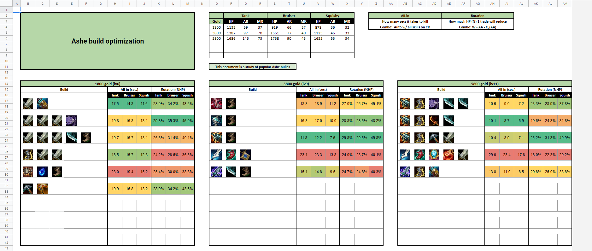

# ItemAnalyzer
Google Apps Script that creates build-dps tables with the League of Legends Damage Calculator by Crixaliz v2.07

Disclaimer: Script was built for a particular version of the calculator and results may change if the interface layout changes. Implementation is quick and dirty, code is readable and annotated for developers but not intended for end users.

## Proof of Concept

Chart layout by Kake et. al, <i>Flamengo Esports</i>.

Implementation can be seen at https://docs.google.com/spreadsheets/d/1bmaukzJu8VOSHzb8eJDdP3IClYodudAG3K3CNONbdYw/edit?usp=sharing
